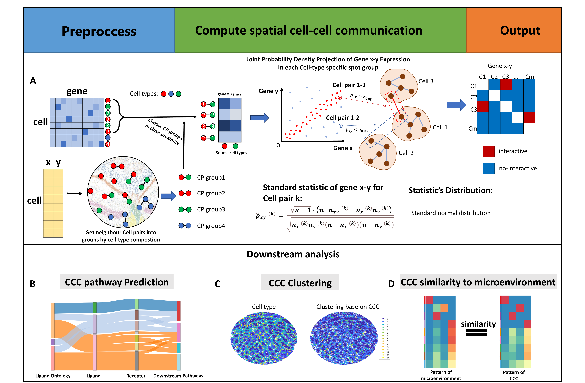
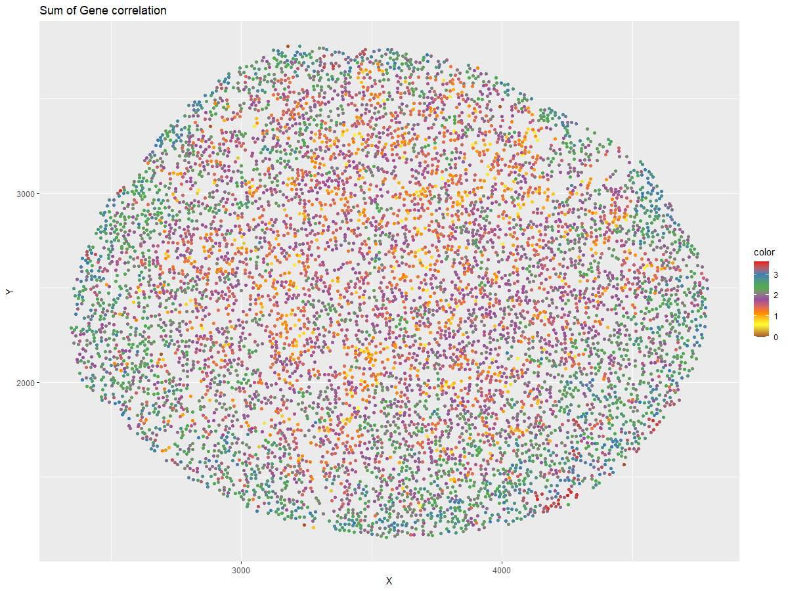
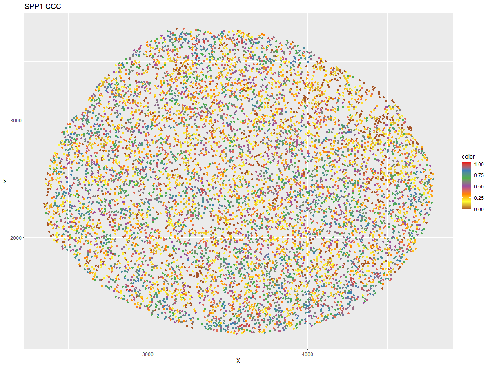
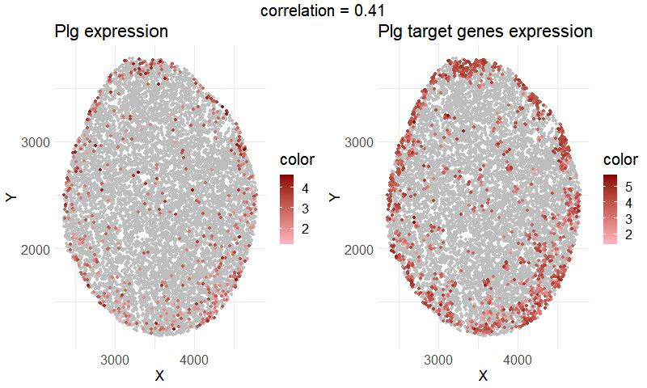
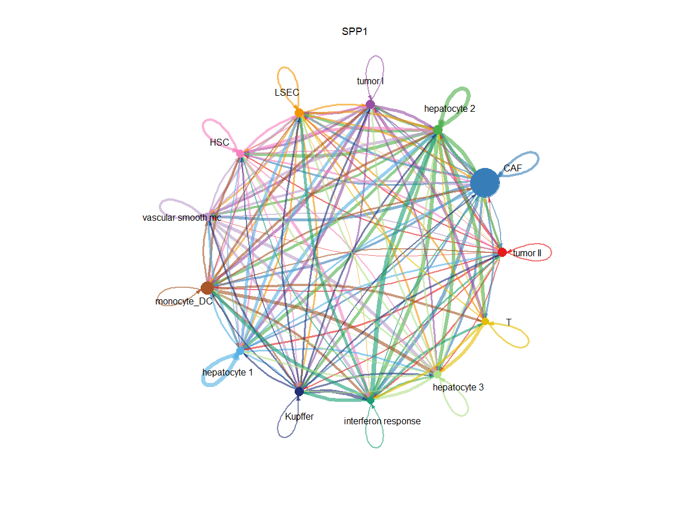
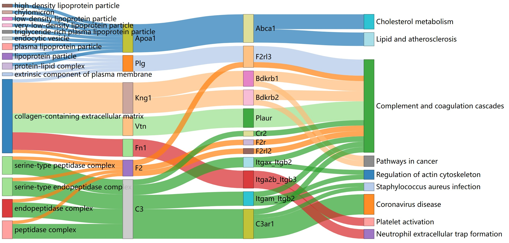
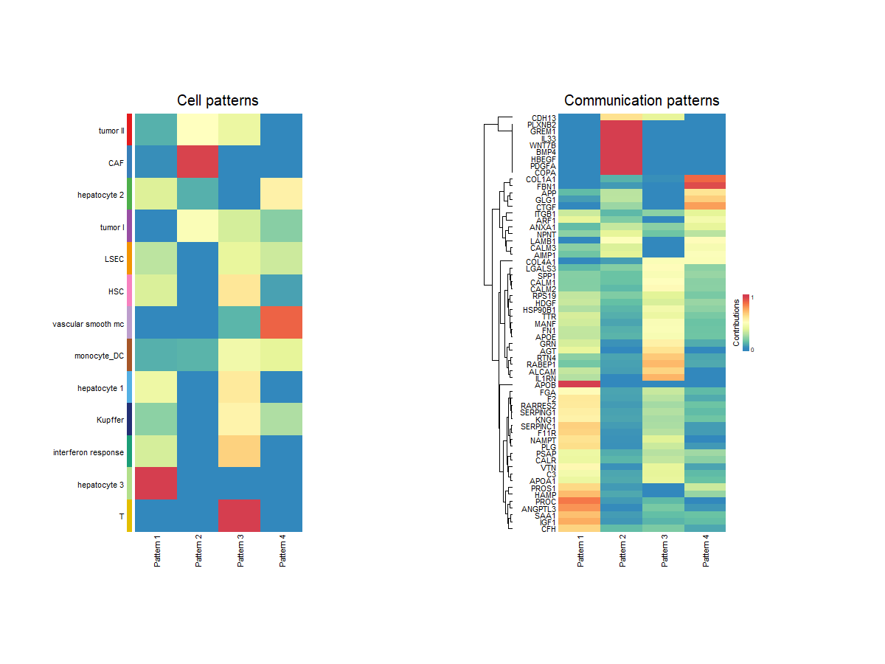

# IGAN
A method for Inferring cell-cell communication pathways represented by spatial gene associations based on spatial transcriptomic data
  

## Installation
IGAN can be installed in R by devtools:

``devtools::install_github('Zhu-JC/IGAN')``

## Tutorials
``library(IGAN)``  
``library(clusterProfiler)``  
``library(org.Hs.eg.db)``  
``library(org.Mm.eg.db)``  
``library(ggplot2)``  
``library(ggsankey)``  
``library(networkD3)``  
``library(KEGGREST)``  
``library(tidyverse)``  
``library(plotly)``  
``library(magick)``  
``library(CellChat)``  
``library(patchwork)``  
``library(NMF)``  
``library(ggalluvial)``  
``library(ComplexHeatmap)``  

__#loading input datas.__  
__##spatial is coordinate information, a dataframe which rows represent spots and 2 cols represent coordinate.__  
``spatial = read.csv('spatial.csv')``  

__##ident is celltype information, a 1 column dataframe which rows represent spots.__  
``ident = read.csv('ident.csv')``  

__##M is gene expression matrix, a dataframe which cols represent genes and rows represent spots.__  
``M = read.csv('M')``

__##gene is genes' name of the dataset, a 1 column dataframe which rows represent genes.__  
``gene = read.csv('gene.csv')``  

__##genelist1 is gene list selected in sending spots, a 1 column dataframe which rows represent genes.__  
``genelist1 = read.csv('genelist1')``  

__##genelist2 is gene list selected in receiving spots, a 1 column dataframe which rows represent genes.__  
``genelist2 = read.csv('genelist2')``  

``gene2 = toupper(gene[,1])``  
``gene_list1 = toupper(gene_list1[,1])``  
``gene_list2 = toupper(gene_list2[,1])``  
``match_list1 = na.omit(match(gene_list1, gene2))``  
``match_list2 = na.omit(match(gene_list2, gene2))``  

__#Grouping spots pairs into groups.__  
``celltype = as.data.frame(c('CAF','HSC','Kupffer','LSEC','T','hepatocyte 1','hepatocyte 2','hepatocyte 3','interferon response','monocyte_DC','vascular smooth mc','tumor I','tumor II'))``
``cells_group = cells_to_group(spatial, ident, 5000, celltype)``  

__#Compute gene-gene associations in every single spots pair.__  
``result = IGAN(match_list1, match_list2, gene, cells_group, M, 0.01)``  
result is a list of n lists, n is the number of groups get in ``cells_to_group``. Each list in result containing m dataframes, m is the number of genes corresponding ``gene_list1``. In each dataframe, rows represent target genes' order which corresponding ``gene_list2`` and cols represent the order of cell pairs within the corresponding groups. 0 represents no association and 1 represents having association.

__#Loading the precomputed tumor data.__  
load('tumor.Rdata')  

__#Get the matrix contain every spots' CCC feature.__  
``cccM = get_cccM(result, cells_group, spatial, gene, match_list1, match_list2)``  
cccM is described in network analysis of IGAN part in our paper.  

``Gene_corM = getGene_corM(result, cells_group, gene, match_list1, match_list2)``

__#Get the graph of CCC activity of every spot.__  
``a = plot_cor(result, cells_group, spatial)``  
``a + scale_color_distiller(palette = "Set1")``  
  

__#Get the graph of SPP1's CCC activity of every spot.__  
``a = plot_Genecor('SPP1', result, cells_group, spatial, match_list1, gene)``  
``a + scale_color_distiller(palette = "Set1")``  
  

``plot_ligand_target(result, spatial, cells_group, gene, match_list1, match_list2, 'Plg')``
  

__#Get the cellchat's network circle graph.__  
``par(mfrow = c(1,1), xpd=TRUE)``  
``plot_cellchat('SPP1',result,cells_group,gene,match_list1,ident)``  
``dev.off()``  
  

__#Get the  sankey graph of ligand's GO-ligand-recepter-downstream pathway.__  
``OrgDb = org.Mm.eg.db``
``sankey_graph = plot_sankey(result,cells_group,gene,match_list1,match_list2,0.05,5,OrgDb = OrgDb,send_cell = 'monocyte_DC',rec_cell = 'CAF',threshold = 10)``  
``sankeyNetwork(Links = sankey_graph[[1]], Nodes =sankey_graph[[2]], Source = 'source',
              Target = 'target', Value = 'value', NodeID = 'name',LinkGroup = 'color',
              units = 'TWh', fontSize = 20, nodeWidth = 30, margin = 1, height = NULL,
              sinksRight = FALSE)``  
``dev.off()`` 
  

__#Get the graph of CCC pattern.__  
``pattern_graph = plot_pattern(result,cells_group,gene,match_list1,match_list2,ident,'outgoing',4)``  
``pushViewport(viewport(x = 0.1, y = 0.1, width = 0.2, height = 0.8, just = c("left", "bottom")))``  
``grid.draw(pattern_graph[[1]])``  
``popViewport()``  
``pushViewport(viewport(x = 0.6, y = 0.1, width = 0.2, height = 0.8, just = c("left", "bottom")))``  
``grid.draw(pattern_graph[[2]])``  
``popViewport()``  
  
