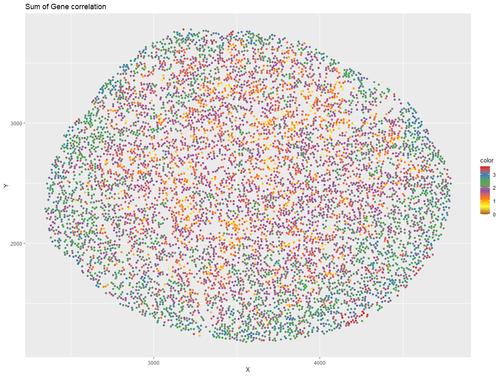

# IGAN
A method for Inferring cell-cell communication pathways represented by spatial gene associations based on spatial transcriptomic data
  

## Installation
IGAN can be installed in R by devtools:

``devtools::install_github('ZJC/IGAN')``

## Tutorials
``library(IGAN)``  
``library(clusterProfiler)``  
``library(org.Hs.eg.db)``  
``library(org.Mm.eg.db)``  
``library(ggplot2)``  
``library(ggsankey)``  
``library(networkD3)``  
``library(KEGGREST)``  
``library(tidyverse)``  
``library(plotly)``  
``library(magick)``  
``library(CellChat)``  
``library(patchwork)``  
``library(NMF)``  
``library(ggalluvial)``  
``library(ComplexHeatmap)``  

__#loading input datas.__  
__##spatial is coordinate information, a dataframe which rows represent spots and 2 cols represent coordinate.__  
``spatial = read.csv('spatial.csv')``  

__##ident is celltype information, a 1 column dataframe which rows represent spots.__
``ident = read.csv('ident.csv')``  

__##M is gene expression matrix, a dataframe which cols represent genes and rows represent spots.__  
``M = read.csv('M')``

__##gene is genes' name of the dataset, a 1 column dataframe which rows represent genes.__  
``gene = read.csv('gene.csv')``  

__##genelist1 is gene list selected in sending spots, a 1 column dataframe which rows represent genes.__  
``genelist1 = read.csv('genelist1')``  

__##genelist2 is gene list selected in receiving spots, a 1 column dataframe which rows represent genes.__  
``genelist2 = read.csv('genelist2')``  

``gene = toupper(gene[,1])``  
``gene_list1 = toupper(gene_list1[,1])``  
``gene_list2 = toupper(gene_list2[,1])``  
``match_list1 = na.omit(match(gene_list1, gene))``  
``match_list2 = na.omit(match(gene_list2, gene))``  

__#Grouping spots pairs into groups.__  
``cells_group = cells_to_group(spatial, ident, 5000, celltype)``  

__#Compute gene-gene associations in every single spots pair.__  
``result = IGAN(match_list1, match_list2, gene, cells_group, M, 0.01)``  
result is a list of n lists, n is the number of groups get in ``cells_to_group``. Each list in result containing m dataframes, m is the number of genes corresponding ``gene_list1``. In each dataframe, rows represent target genes' order which corresponding ``gene_list2`` and cols represent the order of cell pairs within the corresponding groups. 0 represents no association and 1 represents having association.

__#Loading the precomputed tumor data.__  
load('tumor.Rdata')  

__#Get the matrix contain every spots' CCC feature__  
``cccM = get_cccM(result, cells_group, spatial, gene, match_list1, match_list2)``  
cccM is described in network analysis of IGAN part in our paper.  

__#Get the graph of CCC activity of every spot__  
``a = plot_cor(result, cells_group, spatial)``  
``a + scale_color_distiller(palette = "Set1")``  

